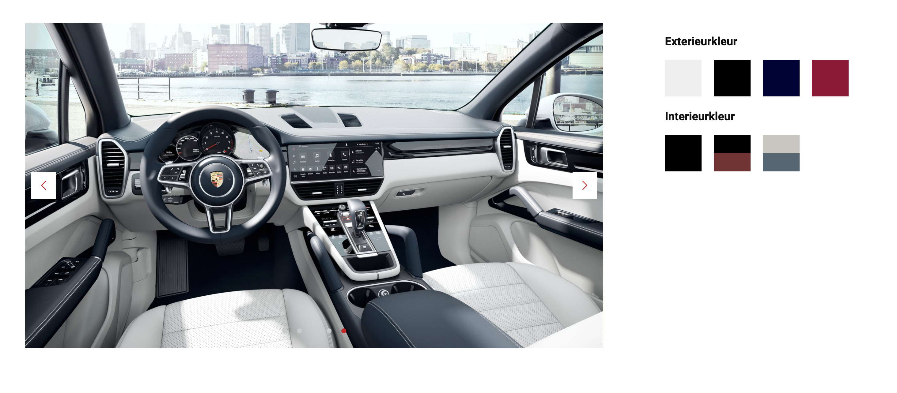

# Procesverslag
Markdown is een simpele manier om HTML te schrijven.  
Markdown cheat cheet: [Hulp bij het schrijven van Markdown](https://github.com/adam-p/markdown-here/wiki/Markdown-Cheatsheet).

Nb. De standaardstructuur en de spartaanse opmaak van de README.md zijn helemaal prima. Het gaat om de inhoud van je procesverslag. Besteedt de tijd voor pracht en praal aan je website.

Nb. Door *open* toe te voegen aan een *details* element kun je deze standaard open zetten. Fijn om dat steeds voor de relevante stuk(ken) te doen.

## Jij

  
uitwerken voor kick-off werkgroep

  ### Auteur:
  Bahaa Salaymeh

  #### Je startniveau:
  Zwart

  #### Je focus:
  Responsive en Surface Plane
 

## Je website

  
uitwerken voor kick-off werkgroep

  ### Je opdracht:
  https://www.porsche.com/netherlands/nl/

  #### Screenshot(s) van de eerste pagina (small screen - phone): 
  Homepagina - Phone
  
  
  
  #### Screenshot(s) van de eerste pagina (medium screen - tablet): 
  Homepagina - Tablet
  
  

  #### Screenshot(s) van de eerste pagina (large screen - desktop): 
  Homepagina - Desktop
  
  

  #### Screenshot(s) van de tweede pagina (small screen - phone): 
  Configureren pagina - Phone
  
  

  #### Screenshot(s) van de tweede pagina (medium screen - tablet): 
  Configureren pagin - Tablet
  
   

  #### Screenshot(s) van de tweede pagina (large screen - desktop): 
  Configureren pagin - Desktop
  
   
 

## Toegankelijkheidstest 1/2 (week 1)

  
uitwerken na test in 1e werkgroep

  ### Bevindingen
  Bevindingen:
  - Modellen section is niet toegankelijk. Hier worden alleen de buttons genoemd en dit geeft een geen heldere beeld waar elke item voor bestaat.
  - Het menu is goed toegankelijk. De gebruiker krijgt de opties te horen van de geselecteerde model wanneer er op gedrukt wordt en het menu is uitgeklapt.
  - Het configureren pagina is helemaal niet toegankelijk. De kleuren worden niet uitgesproken en de foto's hebben geen alt teksten.

  #### Screenreader
  Hier korte omschrijving (met indien nodig afbeeldingen)
  Deze tekst heb ik uitgevoerd op de twee pagina's die ik ga namaken. Er is uitgebleken dat sommige delen van de pagina's niet toegankelijk genoeg zijn.

  Hier een omschrijving van hoe het opgelost kan worden (met indien nodig afbeeldingen)
  - Het configureren pagina kan meer toegankelijk worden, want op dit moment is het helemaal niet toegankelijk. De foto's kunnen niet geselecteerd worden en de kleuren worden niet uitgesproken.
  

  - Het modellen section kan meer toegankelijk worden door de namen van de modellen ook als links te plaatsen.
  

  #### Muis en Toetsenbord 
  n.v.t

  #### Motoriek (shocks, elastiekjes)
  n.v.t

  #### Visueel (brillen, contrast, kleurenblind, dark/light). 
  n.v.t

## Breakdownschets (week 1)

  
uitwerken na afloop 2e werkgroep

  ### Homepagina: 

  

  ### dynamisch deel (bijv menu): 
  

  ### Configureren pagina: 
  

## Voortgang 1 (week 2)

  
uitwerken voor 1e voortgang

  ### Stand van zaken
  Dit ging goed
  - Het maken van het mega menu en de plaatsing van de nav-items. Met dit ben ik met mijn website begonnen, omdat het een uitdagende taak is.
  
  
  - Slider aanmaken en goed stijlen. Voor dit ging ik veel zoeken naar oplossingen en handige tools om alle functionaliteiten na te kunnen maken van de slider die op de officiele website staat. Auto-play en smooth scrollen zijn belangrijke functies die de slider mooier en efficient maken. Deze allemaal heb ik gevonden bij swiperjs.com en dit heb ik toegepast in mijn website.
  

  Dit ging lastig
  - De juiste content van de juiste menu-item laten zien. In het begin was het veel uitproberen om de items en de content goed aan elkaar te kunnen koppelen. In het begin had ik een normale loop die het probleem niet oplost. Door middel van foreach te gebruiken heb ik het compact kunnen oplossen.
  

  Mijn focus voor volgende week
  - Volgende week ga ik aan de slag met het configureren pagina aan de slag. Hierbij zal ik goed nadenken over hoe ik het configureren pagina goed toegankelijk kan bouwen.

  ### Agenda voor meeting
  samen met je groepje opstellen

  | Bahaa          | student 2          | student 3    | student 4        |
  | ---            | ---                | ---          | ---              |
  | Hoe kan ik mijn website nog meer toegankelijk maken?  | en dit             | en ik dit    | en dan ik dat    |
  | Wat zou ik nog kunnen toevoegen aan mijn website? | dit als er tijd is | nog een punt | dit wil ik zeker |
  | ...            | ...                | ...          | ...              |

  ### Verslag van meeting
  hier na afloop snel de uitkomsten van de meeting vastleggen

  - Interasection observer verwerken in website. (Extra surface plane)
  - Media queries toepassen met prefers reduced motion.
  - Sommige mensen kunnen hier last van hebben (visueel)
  - Contrast en kleuren.
  - Responsive maken voor elke device.
- ...

## Voortgang 2 (week 3)

  
uitwerken voor 2e voortgang

  ### Stand van zaken
  Dit ging goed
  - Het maken van de slider voor het configureren pagina. Dit ging soepel en makkelijk, omdat ik voor de homepagina een soortgelijke slider heb aangemaakt.
  
  
  - Na het goed uitzoeken naar hoe ik het configureren functie werkend kan krijgen en wat ik met de data moet doen, is het mij gelukt om een compacte code te schrijven die ervoor zorgt dat de exterior wordt aangepast en de data op een efficiente manier worden opgeslagen.
  
  

  Dit ging lastig
  - Het wijzigen van de interior van een auto. Dit ging lastig, omdat ik alleen een paar slides wil aanspreken. Na veel uitproberen is het mij gelukt om de interior foto's aan te passen zonder dat de exterior foto's worden aangepast.
  
  

  Mijn focus voor volgende week
  - Volgende week ga ik me focussen op responsive design en surface plane elementen in de website toevoegen. Ook ga ik aan de slag met toegankelijkheid en de website goed toegangelijk maken en goed testen.

  ### Agenda voor meeting
  samen met je groepje opstellen

  | student 1      | student 2          | student 3    | student 4        |
  | ---            | ---                | ---          | ---              |
  | dit bespreken  | en dit             | en ik dit    | en dan ik dat    |
  | en dat ook nog | dit als er tijd is | nog een punt | dit wil ik zeker |
  | ...            | ...                | ...          | ...              |

  ### Verslag van meeting
  hier na afloop snel de uitkomsten van de meeting vastleggen
- ...

## Toegankelijkheidstest 2/2 (week 4)

  
uitwerken na test in 8e werkgroep

  ### Bevindingen
  Getest door (Esra Kahraman 09-12-2022)
  - Main menu en mega menu beter met toetsenbord laten bedienen.
  - Contrast is een handige functie en dit verbetert de website in toegankelijkheid.
  - Modellen naam toegankelijk maken.
  - Kleuren van exterieur worden herhaald met de screenreader.

  #### Screenreader
  Getest door (Esra Kahraman 09-12-2022)
  - Problemen met de navigation bar. Sub items in mega menu worden voor altijd geselecteerd. Het is de bedoeling dat deze worden geselecteerd pas wanneer het menu is uitgeklapt.
  - Modellen section is niet toegankelijk. Configureren en alle modellen buttons geven niet aan om welke model het gaat.
  - Herhaling van zinnen bij configureren pagina.

  #### Muis en Toetsenbord 
  n.v.t

  #### Motoriek (shocks, elastiekjes)
  n.v.t

  #### Visueel (brillen, contrast, kleurenblind, dark/light). 
  n.v.t

## Voortgang 3 (week 4)

  
uitwerken voor 3e voortgang

  ### Stand van zaken
  hier dit ging goed & dit was lastig (neem ook screenshots op van delen van je website en code)

  ### Agenda voor meeting
  samen met je groepje opstellen

  | student 1      | student 2          | student 3    | student 4        |
  | ---            | ---                | ---          | ---              |
  | dit bespreken  | en dit             | en ik dit    | en dan ik dat    |
  | en dat ook nog | dit als er tijd is | nog een punt | dit wil ik zeker |
  | ...            | ...                | ...          | ...              |

  ### Verslag van meeting
  hier na afloop snel de uitkomsten van de meeting vastleggen

  - punt 1
  - punt 2
  - nog een punt
  - ...

## Eindgesprek (week 5)

  
uitwerken voor eindgesprek

  ### Je uitkomst - karakteristiek screenshots:
  - Porsche - Desktop
  
  

  - Porsche - Contrast & Large Font
  

  - Porsche - Phone
  
  

  ### Dit ging goed/Heb ik geleerd:
  - Media queries voor contrast en reduce motion.
  - Het maken van een mega menu.
  - Verschillende foto's kunnen aanpassen met javascript en ook de alt tekst toevoegen.
  - Foreach loops en het schrijven van een compacte js code.
  - Grid en flex-boxes.
  - Focus, Active en ook animaties met css.
  - IntersectionObserver met JS.
  - Het maken van sliders.
  - CSS variabelen.
  - De website toegankelijk maken en testen.
  

  ### Dit was lastig/Is niet gelukt:
  - Het details menu op telefoon met een animatie op de tweede details pagina.
  - Switchen naar laatste slide wanneer er op een interior kleur wordt gedrukt.
  - Transition wanneer het mega menu sluit.
  

## Bronnenlijst

  1. https://www.porsche.com/
  2. https://www.porsche.com/netherlands/nl/
  3. https://swiperjs.com
  4. https://css-tricks.com/snippets/css/complete-guide-grid/
  5. https://dev.to/jslim/fading-up-sections-using-intersection-observer-3fhj
  6. https://loading.io/css/
  7. https://www.freecodecamp.org/news/how-to-add-skip-to-main-content-links-to-a-website/#:~:text=A%20%22skip%20to%20content%22%20link,when%20it%20is%20in%20focus.
  8. 

