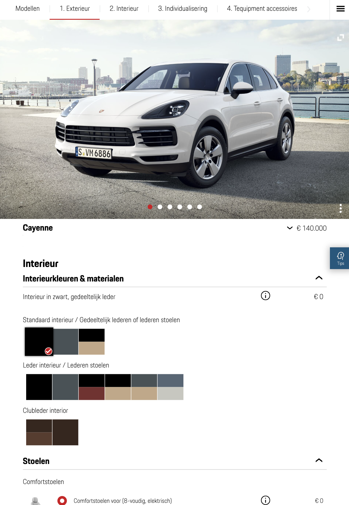

# Procesverslag
Markdown is een simpele manier om HTML te schrijven.  
Markdown cheat cheet: [Hulp bij het schrijven van Markdown](https://github.com/adam-p/markdown-here/wiki/Markdown-Cheatsheet).

Nb. De standaardstructuur en de spartaanse opmaak van de README.md zijn helemaal prima. Het gaat om de inhoud van je procesverslag. Besteedt de tijd voor pracht en praal aan je website.

Nb. Door *open* toe te voegen aan een *details* element kun je deze standaard open zetten. Fijn om dat steeds voor de relevante stuk(ken) te doen.

## Jij

  
uitwerken voor kick-off werkgroep

  ### Auteur:
  Bahaa Salaymeh

  #### Je startniveau:
  Zwart

  #### Je focus:
  Responsive en Surface Plane
 

## Je website

  
uitwerken voor kick-off werkgroep

  ### Je opdracht:
  https://www.porsche.com/netherlands/nl/

  #### Screenshot(s) van de eerste pagina (small screen - phone): 
  Homepagina - Phone
  
  
  
  #### Screenshot(s) van de eerste pagina (medium screen - tablet): 
  Homepagina - Tablet
  
  

  #### Screenshot(s) van de eerste pagina (large screen - desktop): 
  Homepagina - Desktop
  
  

  #### Screenshot(s) van de tweede pagina (small screen - phone): 
  Configureren pagina - Phone
  
  

  #### Screenshot(s) van de tweede pagina (medium screen - tablet): 
  Configureren pagin - Tablet
  
   

  #### Screenshot(s) van de tweede pagina (large screen - desktop): 
  Configureren pagin - Desktop
  
   
 

## Toegankelijkheidstest 1/2 (week 1)

  
uitwerken na test in 1e werkgroep

  ### Bevindingen
  Bevindingen:
  - Modellen section is niet toegankelijk. Hier worden alleen de buttons genoemd en dit geeft een geen heldere beeld waar elke item voor bestaat.
  - Het menu is goed toegankelijk. De gebruiker krijgt de opties te horen van de geselecteerde model wanneer er op gedrukt wordt en het menu is uitgeklapt.
  - Het configureren pagina is helemaal niet toegankelijk. De kleuren worden niet uitgesproken en de foto's hebben geen alt teksten.

  #### Screenreader
  Hier korte omschrijving (met indien nodig afbeeldingen)
  Deze tekst heb ik uitgevoerd op de twee pagina's die ik ga namaken. Er is uitgebleken dat sommige delen van de pagina's niet toegankelijk genoeg zijn.

  Hier een omschrijving van hoe het opgelost kan worden (met indien nodig afbeeldingen)
  - Het configureren pagina kan meer toegankelijk worden, want op dit moment is het helemaal niet toegankelijk. De foto's kunnen niet geselecteerd worden en de kleuren worden niet uitgesproken.
  

  - Het modellen section kan meer toegankelijk worden door de namen van de modellen ook als links te plaatsen.
  

  #### Muis en Toetsenbord 
  n.v.t

  #### Motoriek (shocks, elastiekjes)
  n.v.t

  #### Visueel (brillen, contrast, kleurenblind, dark/light). 
  n.v.t

## Breakdownschets (week 1)

  
uitwerken na afloop 2e werkgroep

  ### Homepagina: 

  

  ### dynamisch deel (bijv menu): 
  

  ### Configureren pagina: 
  

## Voortgang 1 (week 2)

  
uitwerken voor 1e voortgang

  ### Stand van zaken
  hier dit ging goed & dit was lastig (neem ook screenshots op van delen van je website en code)

  ### Agenda voor meeting
  samen met je groepje opstellen

  | Bahaa          | student 2          | student 3    | student 4        |
  | ---            | ---                | ---          | ---              |
  | Hoe kan ik mijn website nog meer toegankelijk maken?  | en dit             | en ik dit    | en dan ik dat    |
  | Wat zou ik nog kunnen toevoegen aan mijn website? | dit als er tijd is | nog een punt | dit wil ik zeker |
  | ...            | ...                | ...          | ...              |

  ### Verslag van meeting
  hier na afloop snel de uitkomsten van de meeting vastleggen

  - Interasection observer verwerken in website. (Extra surface plane)
  - Media queries toepassen met prefers reduced motion.
  - Sommige mensen kunnen hier last van hebben (visueel)
  - Contrast en kleuren.
  - Responsive maken voor elke device.
- ...

## Voortgang 2 (week 3)

  
uitwerken voor 2e voortgang

  ### Stand van zaken
  hier dit ging goed & dit was lastig (neem ook screenshots op van delen van je website en code)

  ### Agenda voor meeting
  samen met je groepje opstellen

  | Bahaa          | student 2          | student 3    | student 4        |
  | ---            | ---                | ---          | ---              |
  | Hoe kan ik mijn website nog meer toegankelijk maken?  | en dit             | en ik dit    | en dan ik dat    |
  | Wat zou ik nog kunnen toevoegen aan mijn website? | dit als er tijd is | nog een punt | dit wil ik zeker |
  | ...            | ...                | ...          | ...              |

  ### Verslag van meeting
  hier na afloop snel de uitkomsten van de meeting vastleggen

  - Interasection obbserver verwerken in website. (Extra surface plane)
  - Media queries toepassen met prefers reduced motion.
  - Sommige mensen kunnen hier last van hebben (visueel)
  - Contrast en kleuren.
  - Responsive maken voor elke device.
- ...

## Toegankelijkheidstest 2/2 (week 4)

  
uitwerken na test in 8e werkgroep

  ### Bevindingen
  Lijst met je bevindingen die in de test naar voren kwamen (geef ook aan wat er verbeterd is):

  #### Screenreader
  Hier korte omschrijving (met indien nodig afbeeldingen)

  Hier een omschrijving van hoe het opgelost kan worden (met indien nodig afbeeldingen)

  #### Muis en Toetsenbord 
  Hier korte omschrijving (met indien nodig afbeeldingen)

  Hier een omschrijving van hoe het opgelost kan worden (met indien nodig afbeeldingen)

  #### Motoriek (shocks, elastiekjes)
  Hier korte omschrijving (met indien nodig afbeeldingen)

  Hier een omschrijving van hoe het opgelost kan worden (met indien nodig afbeeldingen)

  #### Visueel (brillen, contrast, kleurenblind, dark/light). 
  Hier korte omschrijving (met indien nodig afbeeldingen)

  Hier een omschrijving van hoe het opgelost kan worden (met indien nodig afbeeldingen)

## Voortgang 3 (week 4)

  
uitwerken voor 3e voortgang

  ### Stand van zaken
  hier dit ging goed & dit was lastig (neem ook screenshots op van delen van je website en code)

  ### Agenda voor meeting
  samen met je groepje opstellen

  | student 1      | student 2          | student 3    | student 4        |
  | ---            | ---                | ---          | ---              |
  | dit bespreken  | en dit             | en ik dit    | en dan ik dat    |
  | en dat ook nog | dit als er tijd is | nog een punt | dit wil ik zeker |
  | ...            | ...                | ...          | ...              |

  ### Verslag van meeting
  hier na afloop snel de uitkomsten van de meeting vastleggen

  - punt 1
  - punt 2
  - nog een punt
  - ...

## Eindgesprek (week 5)

  
uitwerken voor eindgesprek

  ### Je uitkomst - karakteristiek screenshots:
  

  ### Dit ging goed/Heb ik geleerd: 
  Korte omschrijving met plaatjes

  

  ### Dit was lastig/Is niet gelukt:
  Korte omschrijving met plaatjes

  

## Bronnenlijst

  
continu bijhouden terwijl je werkt

  Nb. Wees specifiek ('css-tricks' als bron is bijv. niet specifiek genoeg).

  1. https://www.porsche.com/
  2. https://www.porsche.com/netherlands/nl/
  3. https://swiperjs.com
  4. https://css-tricks.com/snippets/css/complete-guide-grid/
  5. 

